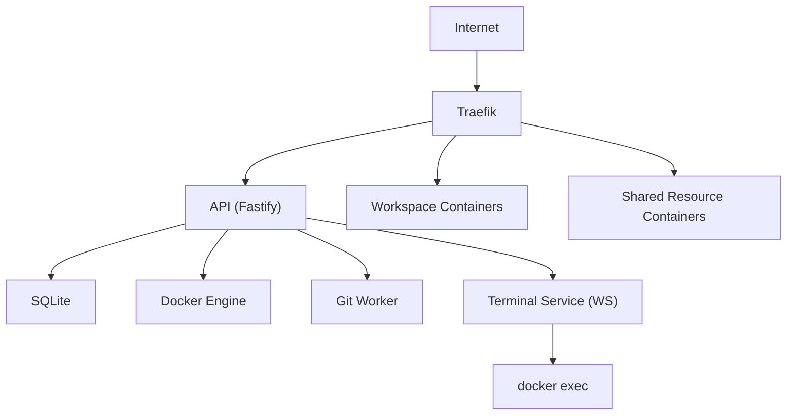
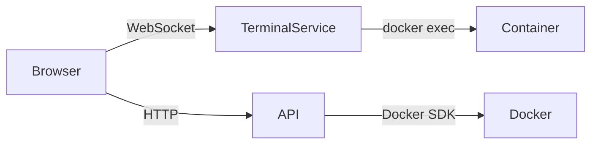

# Arquitetura

[← Voltar ao índice](./README.md)

## Visão geral

```text
Internet
    │
    ▼
 Traefik
    │
    ▼
 API
    │
    ├── SQLite
    ├── Docker Engine
    ├── Git Worker
    └── Terminal Service
```

## Diagrama de componentes



## Fluxo Terminal e API



## Tecnologias

| Camada     | Tecnologia | Motivo                                      |
|------------|------------|---------------------------------------------|
| Backend    | Fastify    | Leve, rápido, excelente integração com Docker |
| Frontend   | Nuxt       | Dashboard, catálogo, workspaces, logs, terminal, admin |
| Banco      | SQLite     | Simples, sem manutenção, baixo consumo      |
| Proxy      | Traefik    | Integração nativa com Docker, rotas dinâmicas, HTTPS |
| Containers | Docker     | Simplicidade, baixo overhead, amplamente conhecido |

## Rede Docker (recomendado)

- Cada **workspace** recebe sua própria Docker network, evitando conflitos de porta e vazamento entre ambientes.
- **Shared Resources** ficam em uma rede `lab-shared`, acessível por todos os workspaces autorizados.
