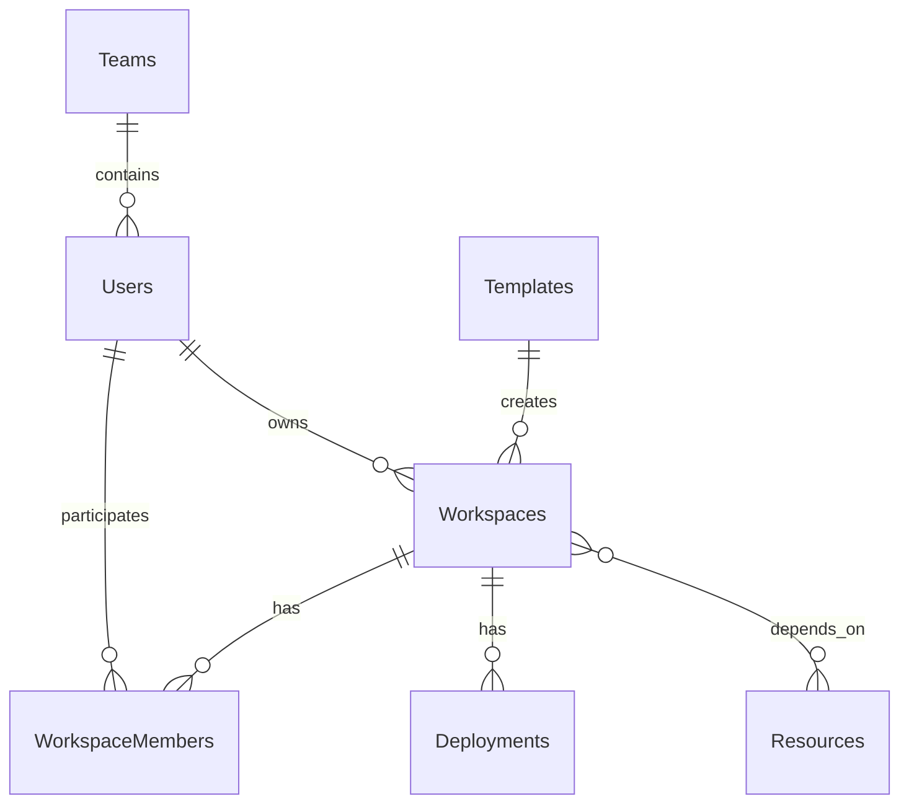

# Modelo de Dados

[← Voltar ao índice](./README.md)

## Users

```text
id
name
email
role
```

## Teams

```text
id
name
description
```

## Resources

```text
id
name
type
endpoint
description
visibility
```

## Workspaces

```text
id
key
name
description

owner_id

cpu_limit
memory_limit

visibility
```

## Workspace Members

```text
workspace_id
user_id
role
```

## Templates

```text
id
name
description
definition
```

## Deployments

```text
id
workspace_id
commit_hash
status
created_at
```

## Relacionamentos principais


